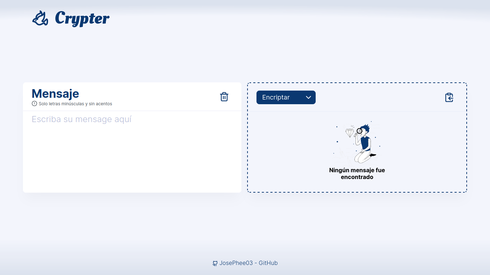

# Alura - Challenge ONE

## 📚 Sprint 01: Construye un encriptador de texto con Javascript

### Descripción

Las _"llaves"_ de encriptación que utilizaremos son las siguientes:

`La letra "e" es convertida para "enter"`

`La letra "i" es convertida para "imes"`

`La letra "a" es convertida para "ai"`

`La letra "o" es convertida para "ober"`

`La letra "u" es convertida para "ufat"`

### Requisitos:

- Debe funcionar solo con letras **minúsculas**

- No deben ser utilizados letras con acentos ni caracteres especiales

- Debe ser posible convertir una palabra para la versión encriptada también devolver una palabra encriptada para su versión original.

- Por ejemplo:

  `"gato" => "gaitober"`

  `"gaitober" => "gato"`

- La página debe tener campos parainserción del texto que será **encriptado** o **desencriptado**, y el usuario debe poder escoger entre as dos opciones.

- El resultado debe ser mostrado en la pantalla.
